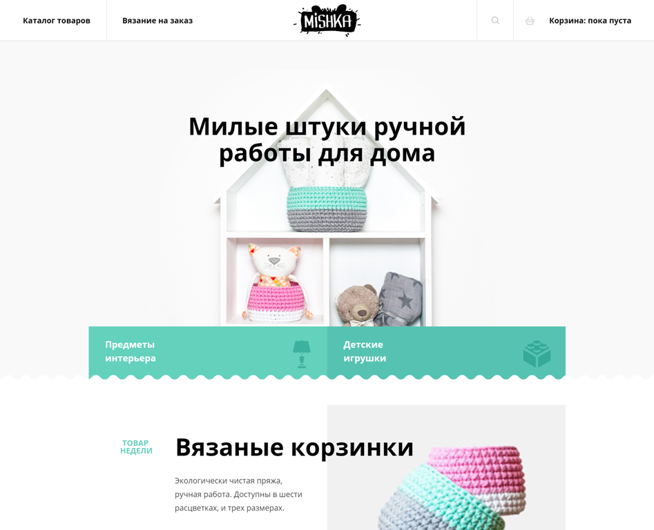

# Репозиторий проекта Mishka
## <a href="https://askomarov.github.io/mishka/" target="_blank">Ссылка на готовый проект</a>.
Адаптивная верстка по макету Figma.
Пока выполнена только первая страница.

### Для сборки проекта настроил 

### Не много модульного JavaScript:
- для сборки JavaScript настроил 
- релизовал функциональность меню бургер
- написал простой слайдер в блоке "Отзывы"
- написал функциональность модального окна - открытие/закрытие; блокировка прокрутки основного контента, при открытом модальном окне

